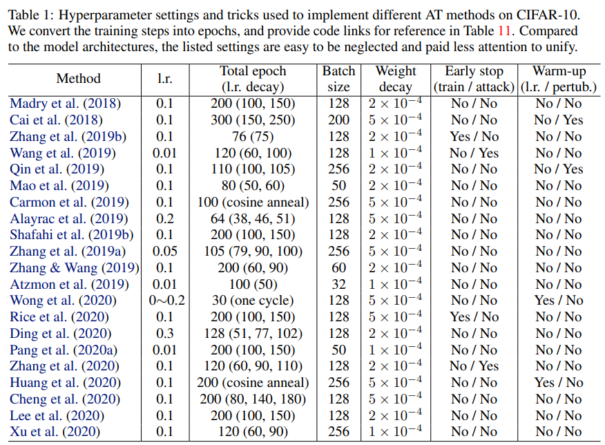

# Different training settings

Although there's a lot of adversarial defense methods, a fair comparison between methods is still difficult because they use different settings, such as the model structure, batch size, learning rate schedule, etc.

Here is the summary of training settings and robustness of each method used in the original paper on CIFAR10.

- **AT - Towards Deep Learning Models Resistant to Adversarial Attacks (Madry et al., 2017)**
    - **Model:** ?
    - **Batch size:** 128
    - **Optimizer:** SGD(momentum=0.9, weight decay=2x10-4)
    - **Learning Rate Decay:** Initial learning rate of 0.1, which is divided by 10 at the 100th and 150th epoch (200 epochs in total).
    - **Training Arguments:** epsilon=8/255 and 7 steps with a step size 2/255.
    - **Early stopping:** None
    - **Performance (Clean/Robustness):** 87.3%/45.8% (PGD20, epsilon=8/255, last).
- **TRADES - Theoretically Principled Trade-off between Robustness and Accuracy (Zhang et al., 2019)**
    - **Model:** ResNet-18
    - **Batch size:** 128
    - **Optimizer:** SGD(momentum=0.9, weight decay=2x10-4)
    - **Learning Rate Decay:** initial learning rate = 0.1, decayed at 75th epoch.
    - **Training Arguments:** epsilon=0.031, 10 steps with a step size 0.007. lambda=1/5 (beta=5).
    - **Early stopping:** The training is stopped at the 76th epoch.
    - **Performance (Clean/Robustness):** 81.72%/50.64% (PGD20, epsilon=0.031, step size 0.003, best).
    - **Remark: (+)** WRN-34-10, 56.61% with the same settings.
- **MART - Improving adversarial robustness requires revisiting misclassified examples (Wang, 2019)**
    - **Model:** ResNet-18
    - **Batch size:** 128
    - **Optimizer:** SGD(momentum=0.9, weight decay=3.5×10−3)
    - **Learning Rate Decay:** Initial learning rate of 0.01, which is divided by 10 at the 75th and 90th epoch (100 epoch).
    - **Training Arguments:** epsilon=8/255, 10 steps with a step size 2/255. lambda=5 (beta=5).
    - **Early stopping:** The epoch right after the first time learning rate decay (i.e., epoch 76).
    - **Performance (Clean/Robustness):** 83.07%/55.57% (PGD20, epsilon=8/255, step size=0.8/255, best)
    - **Remark: (+)** WRN-34-10, 84.17%/58.56% (best), 57.39% (last).(+) WRN-28-10+RST 86.30%/65.04%.
- **Free - Adversarial training for free! (Shafahi et al., 2019)**
    - **Model:** WRN-32-10
    - **Batch size:** 256
    - **Optimizer:** SGD(momentum=0.9, weight decay=2x10-4)
    - **Learning Rate Decay:** [training steps, learning rate] = [[0, 0.1], [40000, 0.01], [60000, 0.001]], (80000 training steps)
    - **Training Arguments:** epsilon=8/255,  m=8.
    - **Early stopping:** None
    - **Performance (Clean/Robustness):** 83.07%/46.82% (PGD20, epsilon=8/255, step size=?, last)
- **Fast - Fast is better than free: Revisiting adversarial training (Wong et al., 2020)**
    - **Model:** PreActResNet-18
    - **Batch size:** 128
    - **Optimizer:** SGD(momentum=0.9, weight decay=5×10−4)
    - **Learning Rate Decay:** Cyclic learning rate scheduling, max=0.2 (epoch 5), min=0 (epoch 15).
    - **Training Arguments:** epsilon=8/255,  step size=10/255.
    - **Early stopping:** None
    - **Performance (Clean/Robustness):** 83.81%/46.06% (PGD50-10, epsilon=8/255, step size=2/255)
- **GradAlign - Understanding and improving fast adversarial training (Andriushchenko et al., 2020)**
    - **Model:** PreActResNet-18
    - **Batch size:** ?
    - **Optimizer:** ?
    - **Training Arguments:** epsilon=8/255, alpha=8/255, beta=0.2.
    - **Early stopping:** None
    - **Learning Rate Decay:** Cyclic learning rate scheduling, 30 epochs with the maximum learning rate 0.3.
    - **Performance (Clean/Robustness):** 81.00%/47.58% (PGD50-10, epsilon=8/255, step size=2/255)
- **AWP - Adversarial Weight Perturbation Helps Robust Generalization**
    - **Model:** PreActResNet-18
    - **Batch size:** 128
    - **Optimizer:** SGD(momentum 0.9, weight decay 5 × 10−4)
    - **Training Arguments:** AT, epsilon=8/255, alpha=2/255, steps=10, γ = 5 × 10−3.
    - **Early stopping:** “best” means the highest robustness that ever achieved at different checkpoints for each dataset.
    - **Learning Rate Decay:** Initial learning rate is 0.1, and divided by 10 at the 100-th and 150-th epoch (200 epochs in total).
    - **Performance (Clean/Robustness):** ?/55.39% (PGD20, epsilon=8/255, step size=2/255, best)
    - **Remark:** (+) WRN-28-10 RST, 88.25%/63.73% (+) WRN-34-10 AT, 85.57%/58.14% (+) WRN-34-10 TRADES 85.36%/59.27% (+) WRN-34-10 MART 84.43%/60.68%. (best)

As shown in the above summary and the table from 'Bag of Tricks for Adversarial Training (Pang et al., 2020)', each paper uses totally different settings. This makes us difficult to compare adversarial defense methods. Recently, to resolve this issue, there is a new line of works to find optimal training settings for adversarial training:

- **Overfitting in adversarially robust deep learning (Rice et al., 2020)**
    - **Model:** WRN-28-10
    - **Training method:** AT and TRDAES (Linf=8/255, step size of 2/255 and steps=10).
    - **Batch size:** 128
    - **Optimizer:** SGD(momentum=0.9, weight decay 5 × 10 −4)
    - **Learning Rate Decay:**  initial learning rate=0.1, decayed by 10× half-way and three-quarters-of-the-way. 200 epochs.
    - **Early Stopping:** PGD 40 on 1024 samples from a separate validation set (disjoint from the training and test set).
- **Uncovering the Limits of Adversarial Training against Norm-Bounded Adversarial Examples (Gowal et al., 2020)**
    - **Model:** WRN-28-10
    - **Training method:** AT (Linf=8/255, L2=128/255, a step-size α of Linf=2/255 and L2=15/255, steps=10), TRDAES, MART, etc.
    - **Optimizer:** SGD(momentum=0.9, weight decay 5×10−4)
    - **Learning Rate Decay:**  initial learning rate=0.1, decayed by 10× half-way and three-quarters-of-the-way. 200 epochs.
    - **Early Stopping:** PGD 40 on 1024 samples from a separate validation set (disjoint from the training and test set).
- **Bag of Tricks for Adversarial Training (Pang et al., 2020)**
    - **Model:** ResNet-18 / WRN-34-10
    - **Training method:** AT (Linf=8/255, step size of 2/255 and steps=10)
    - **Optimizer:** SGD(momentum=0.9, weight decay 5 × 10 −4)
    - **Learning Rate Decay:** initial learning rate=0.1. decay by a factor of 0.1 at 100 and 105 epochs (110 epochs)
    - **Early Stopping:**  the best PGD-10.

